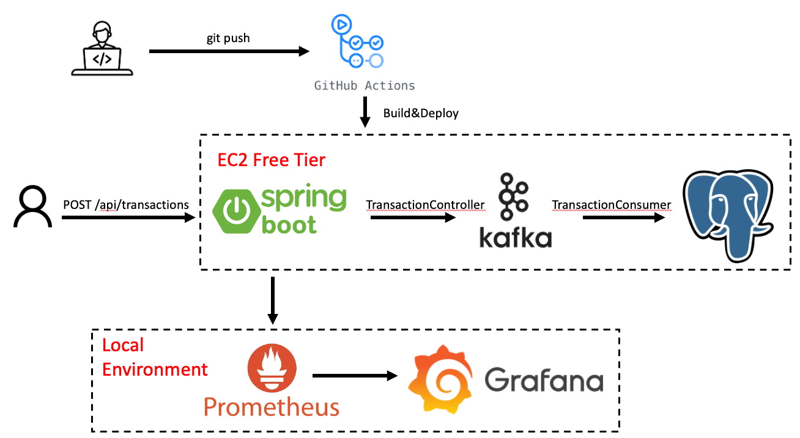

# 🛡️ Fraud Detection Microservice

A lightweight, full-cycle microservice application built with **Spring Boot**, **Apache Kafka**, **PostgreSQL**, **Micrometer**, **Prometheus**, and **Grafana**, deployed via **Docker Compose** and integrated with **GitHub Actions** for CI/CD.

This project is designed to simulate a real-time fraud detection pipeline and demonstrate key technologies across backend microservices, observability, and DevOps automation.



---

## 📦 Features

- REST API to ingest transaction data
- Kafka-based messaging for decoupled transaction processing
- Real-time fraud detection logic
- Persistent storage with PostgreSQL
- Custom metrics exposed via Micrometer and Spring Boot Actuator
- Prometheus for metrics collection
- Grafana for dashboard visualization
- Docker Compose orchestration
- GitHub Actions for automated build and deployment
- Deployable on AWS EC2 (Free Tier friendly)

---

## 🚀 Tech Stack

| Layer           | Tech                                                |
|----------------|-----------------------------------------------------|
| Language        | Java (Spring Boot 3.x)                              |
| Messaging       | Apache Kafka, Zookeeper                             |
| Database        | PostgreSQL                                          |
| Observability   | Micrometer, Prometheus, Grafana                     |
| DevOps          | Docker, Docker Compose, GitHub Actions              |
| Monitoring      | Actuator `/actuator/prometheus` metrics endpoint   |
| Cloud Deployment| AWS EC2 (Amazon Linux 2023)                         |

---

## 📁 Project Structure

```bash
.
├── Dockerfile
├── docker-compose.yml              # Core services
├── docker-compose.prom.yml         # Local Prometheus + Grafana (optional)
├── prometheus.yml                  # Prometheus scrape config
├── src/
│   └── main/
│       ├── java/com/leiber/frauddetection/transaction_api/
│       │   ├── TransactionApiApplication.java
│       │   ├── controller/TransactionController.java
│       │   ├── service/TransactionService.java, TransactionConsumer.java
│       │   ├── repository/TransactionRepository.java
│       │   ├── model/Transaction.java
│       │   └── metrics/FraudMetrics.java
│       └── resources/
│           ├── application.yml
│           └── application.properties
└── test/...
```

---

## ⚙️ API Endpoint

### `POST /api/transactions`

Ingest a new transaction into the system:

```http
POST /api/transactions
Content-Type: application/json

{
  "transactionId": "txn001",
  "userId": "user001",
  "amount": 8000,
  "timestamp": "2025-07-09T10:00:00Z",
  "location": "Brisbane",
  "channel": "mobile"
}
```

---

## 🧪 Metrics

Custom metrics available at `http://<host>:9090/actuator/prometheus`:

- `fraud_transactions_total`: Total transactions processed
- `fraud_detected_total`: Total fraudulent transactions detected

---

## 📊 Monitoring with Grafana

To visualize metrics locally:

1. Run `docker-compose -f docker-compose.prom.yml up`
2. Open Grafana at [http://localhost:3000](http://localhost:3000)
3. Add Prometheus as a data source (`http://prometheus:9090`)
4. Import Spring Boot dashboard `ID: 4701`
5. Add custom panels for:
   - `fraud_transactions_total`
   - `fraud_detected_total`

---

## 🐳 Docker Compose

Run the full service stack (App + PostgreSQL + Kafka + Zookeeper):

```bash
docker compose up --build -d
```

---

## ☁️ Deploying to EC2

1. Provision a Free Tier EC2 (Amazon Linux 2023)
2. Install Docker and Docker Compose
3. Clone this repo to EC2
4. Configure `.env` if needed (optional)
5. Run:

```bash
docker compose up --build -d
```

6. Access the service on `http://<EC2_PUBLIC_IP>:9090`

---

## 🤖 GitHub Actions

This repo includes a GitHub Actions workflow that:

- Installs Maven
- Runs tests
- Builds Docker image
- Connects to EC2 via SSH
- Deploys the latest build

Secrets required in GitHub:

| Secret Name        | Description                          |
|--------------------|--------------------------------------|
| `EC2_SSH_KEY`      | Your EC2 private key (Base64-encoded)|
| `EC2_HOST`         | EC2 public IP                        |
| `EC2_USER`         | Typically `ec2-user`                 |

---

## 📌 To Do / Optional Enhancements

- Add alerting via Prometheus Alertmanager
- Expand fraud detection logic using rules or ML models
- Due to memory limitations of EC2 Free Tier (1GB), only core services are deployed on the cloud. 
  Monitoring components (Prometheus and Grafana) are deployed locally to visualize metrics.

---

## 👨‍💻 Author

Leiber Lyu(leiber1117@gmail.com) — Software Engineer
Australia 🇦🇺  

---

## 📝 License

MIT License – feel free to use and modify.
